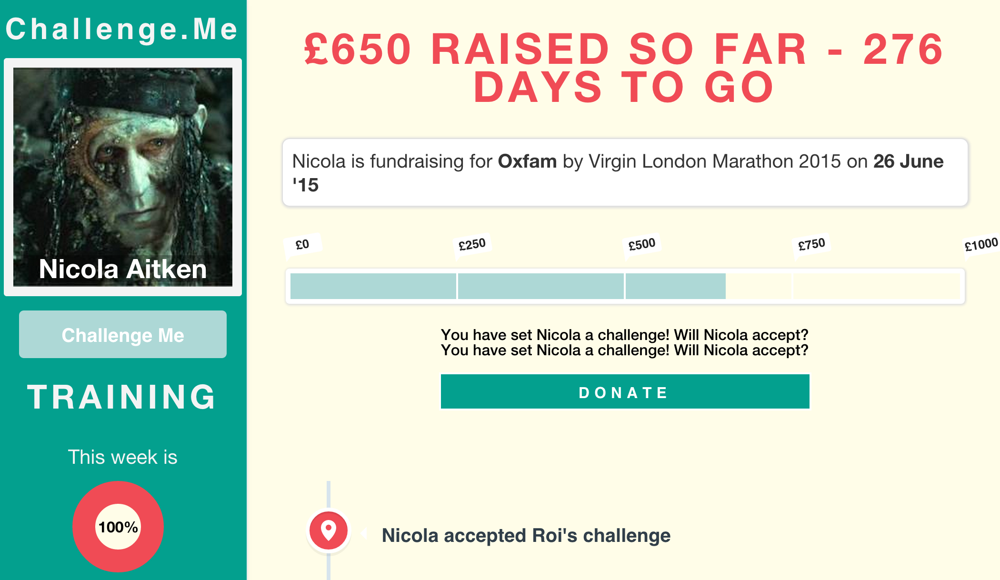

# Challenge Me 
[](https://codeclimate.com/github/yoshdog/challenge-me)
[](https://codeclimate.com/github/yoshdog/challenge-me)



A working version of the app can be found here: [Challenge Me](http://challenge--me.herokuapp.com/)

### Meet the Team: 

  + [Nicola Aitken](https://github.com/aitkenster)
  + [Toan Nguyen](https://github.com/yoshdog)
  + [Jamie Allen](https://github.com/jamieallen59)
  + [Chloe Donegan](https://github.com/csharpd)
  + [Nikesh Ashar](https://github.com/nikeshashar)
  + [Joe Dowdell](https://github.com/joedowdell)

**The Problem**

At the moment, raising money for charity can be quite boring. It boils down to a combination of issues faced by both the participant and sponsor.

1. Problems:
  + People do not want to get spammed all the time.
  + It is quite difficult to remain motivated to carry out your charity event.
  + Asking for sponsorship money can be quite difficult for all parties involved.
  + It's hard for the trainee to get people interested in what they are doing.
  + It's hard to ask for money for something that could be happening at a much later date. 

2. Our Aims:
  + To help motivate the person training for their event and holding them accountable publicly for it.
  + To make sponsors feel less resentful if there is a concept of achievements or challenges involved.


## Technologies Used:

  + Rails
  + Ruby
  + Postgresql
  + Capybara
  + RSpec
  + CSS
  + Javascript
  + jQuery
  + Heroku
  + Devise
  + Amazon S3
  + Paperclip
  + Imagemagick
  
## APIs Used:

  + JustGiving
  + MapMyFitness

### How to set it up
```sh
git clone git@github.com:yoshdog/challenge-me.git
cd challenge-me
bundle
bin/rake db:setup
```

### How to run it
```sh
cd challenge-me
bin/rails s
```

open your browser and go to [localhost:3000](http://localhost:3000)

### How to test it
```sh
cd challenge-me
rspec
```


Youtube link to follow....
